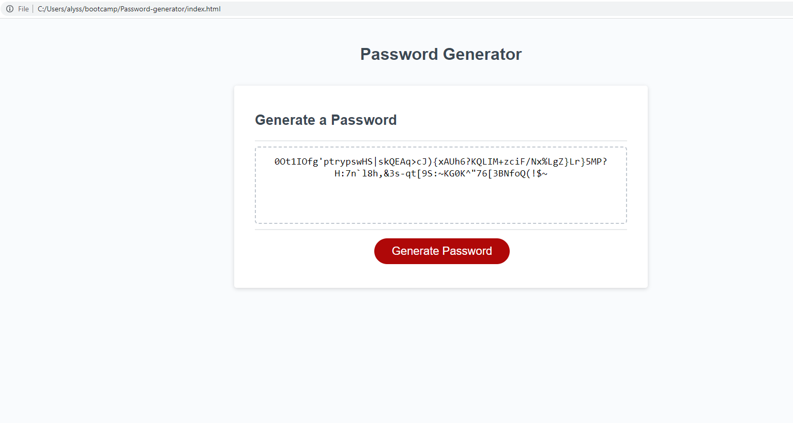

# Password-generator

## Description

The application was completed to perform the function of generating random passwords based on criteria a user can select from to achieve a strong password.
The critera selection within the password generating application includes uppercase, lowercase, special characters and symbols. The user has the option of selecting a password length between 8 and 128 characters long.

To complete this project I created a JavaScript file and wrote the code to run the application to perform the task.

## Installation

The project is deployed using GitHub and available with this URL:https://alyssapidgeon.github.io/Password-generator/

Here is a screenshot of the web application: `md
    
    `

## License

MIT license
